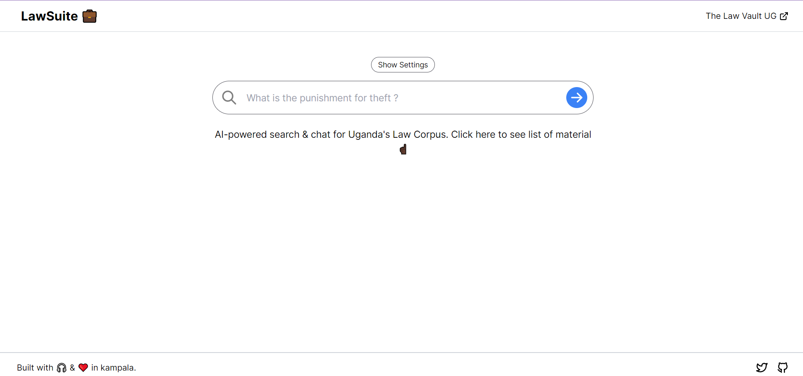

# LawSuite Ug

AI-powered search and chat for [Ugandas Law Corpus](https://the-constitution-of-uganda.vercel.app/)
All code & data used is 100% open-source.

[](https://law-suite.vercel.app/)

## Dataset

The dataset is a json file containing all text.

View it [here](scripts/ugvault.json).

I recommend getting familiar with fetching, cleaning, and storing data as outlined in the scraping and embedding scripts below, but feel free to skip those steps and just use the dataset.

## How It Works

LawSuite provides 2 things:

1. A search interface for Uganda's law corpus e.g constitution, penal code.
2. A chat interface for the information.

### Search

Search was created with [OpenAI Embeddings](https://platform.openai.com/docs/guides/embeddings) (`text-embedding-ada-002`).

First, we loop over our website and generate embeddings for each chunk of text.

Then in the app we take the user's search query, generate an embedding, and use the result to find the most similar passages from the book.

The comparison is done using cosine similarity across our database of vectors.

Our database is a Postgres database with the [pgvector](https://github.com/pgvector/pgvector) extension hosted on [Supabase](https://supabase.com/).

Results are ranked by similarity score and returned to the user.

### Chat

Chat builds on top of search. It uses search results to create a prompt that is fed into GPT-3.

This allows for a chat-like experience where the user can ask questions about the book and get answers.

## Running Locally

Here's a quick overview of how to run it locally.

### Requirements

1. Set up OpenAI

You'll need an OpenAI API key to generate embeddings.

2. Set up Supabase

There is a schema.sql file in the root of the repo that you can use to set up the database.

Run that in the SQL editor in Supabase.

I recommend turning on Row Level Security and setting up a service role to use with the app.

Note: You don't have to use Supabase. Use whatever method you prefer to store your data. But I like Supabase and think it's easy to use.

### Repo Setup

3. Clone repo

```bash
git clone https://github.com/greatsage-raphael/lawSuite.git
```

4. Install dependencies

```bash
npm i
```

5. Set up environment variables

Create a .env.local file in the root of the repo with the following variables:

```bash
OPENAI_API_KEY=

NEXT_PUBLIC_SUPABASE_URL=
SUPABASE_SERVICE_ROLE_KEY=
```

### Dataset

6. Run scraping script

```bash
npm run scrape
```

This scrapes the text of the book from The Network State website and saves it to a json file.

7. Run embedding script

```bash
npm run embed
```

This reads the json file, generates embeddings for each chunk of text, and saves the results to your database.

### App

8. Run app

```bash
npm run dev
```

## Credits

Thanks to [Mckay Wrigley](https://github.com/mckaywrigley) for his work on [The Network State GPT](https://github.com/mckaywrigley/the-network-state-gpt). This project would not be possible if he didn't make the project open-source. I highly recommend you check it out.

## Contact

If you have any questions, feel free to reach out to me on [Gmail](bizzicole87@gmail.com).

## Notes

New feature incoming: Ability to upload a pdf and have questions about the pdf answered.
